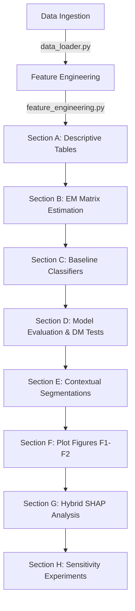

# Real-Time Win Probability Estimation in Twenty20 Cricket: A State-Space Approach to Latent Match Dynamics

This repository contains the complete replication codebase and generated outputs for the paper:  
**"Stochastic State-Space Win Probability Estimation in T20 Cricket using a Kalman Filter"**  
*Submitted to the Journal of Quantitative Analysis in Sports (JQAS).*

Preprint Coming Soon.

---

## Model Formulation & Equations

Traditional machine learning approaches treat ball-by-ball delivery records as independent, static data points. In contrast, this project models the progression of a T20 cricket innings as a continuous, dynamic system governed by three hidden latent variables:
1.  **Latent Batting Strength ($\hat{S}_t$)**: Long-term capability of the batting team relative to the venue's baseline par scores.
2.  **Scoring Momentum ($\hat{M}_t$)**: High-volatility short-term scoring bursts (e.g., chains of boundary hits or dot balls).
3.  **Match Pressure ($\hat{P}_t$)**: Scoreboard stress during run chases, driven by the Required Run Rate (RRR) and resources remaining.

The model is formulated as a linear state-space system with recursive estimation updates:

### 1. State transition (Time Update)
Predicts the latent state vector $x_t \in \mathbb{R}^3$ based on the previous state $x_{t-1}$ and exogenous control variables $u_t \in \mathbb{R}^8$:
$$x_t = A x_{t-1} + B u_t + w_t, \quad w_t \sim \mathcal{N}(0, Q)$$
*   **State Vector**: $x_t = [\hat{S}_t, \hat{M}_t, \hat{P}_t]^T$
*   **Control Vector ($u_t$)**: Captures resources and game phases: `[balls_remaining, wickets_in_hand, run_rate_diff, pressure_index, phase_powerplay, phase_middle, phase_death, required_run_rate]`
*   **$A$ (Transition Matrix)**: Tracks persistence parameters for strength ($\alpha_s = 0.85$), momentum ($\alpha_m = 0.60$), and pressure ($\alpha_p = 0.80$).
*   **$B$ (Control Impact Matrix)**: Models state adjustments driven by resource decay.

### 2. Observation (Measurement Update)
Corrects the latent state estimate when new delivery outcomes $y_t \in \mathbb{R}^{13}$ are observed:
$$y_t = H x_t + v_t, \quad v_t \sim \mathcal{N}(0, R)$$
*   **Observation Vector ($y_t$)**: Tracks rolling window metrics (runs, wickets, dots, boundaries over the last 6, 12, and 24 balls) alongside current run rate.
*   **$H$ (Observation Sensitivity Matrix)**: Maps latent state variables to observed scoreboard updates.

### 3. Joseph Stabilized Form
To prevent mathematical divergence and covariance matrix asymmetry due to floating-point truncation errors over the 120-delivery horizon, the implementation utilizes the Joseph Form for covariance updates:
$$P_t = (I - K_t H) P_{t|t-1} (I - K_t H)^T + K_t R K_t^T$$

### 4. Calibration & Win Probability Estimation
The final win probability $p_t$ is estimated via a calibrated logistic layer using the latent state variables and situational contexts:
$$p_t = \sigma(\beta^T [x_t^T, \text{context}_t^T]^T)$$

---

## 1. Codebase (`code/`)

The [code/](code/) directory contains the execution scripts for the data pipeline, model estimation, evaluation, and plotting.

### Feature Specification
The pipeline processes raw delivery JSON files into a 30-feature matrix:

| Category | Variables | Description |
| :--- | :--- | :--- |
| **Instantaneous Scoreboard** | `current_score`, `wickets_fallen`, `balls_bowled`, `balls_remaining`, `CRR`, `target`, `runs_required`, `RRR`, `wickets_in_hand`, `run_rate_diff`, `pressure_index`, `innings_number` | Raw scoreboard indicators tracking match resources. |
| **Rolling Momentum** | `runs_last_{w}_balls`, `wickets_last_{w}_balls`, `dots_last_{w}_balls`, `boundaries_last_{w}_balls` for $w \in \{6, 12, 24\}$ | Rolling window statistics computed with a 1-ball lag to prevent target leakage. |
| **Match Phase** | `phase_powerplay` (Overs 1-6), `phase_middle` (Overs 7-15), `phase_death` (Overs 16-20) | Binary switches representing innings stages. |
| **Venue Context** | `venue_avg_first_innings`, `par_deviation` | Contextual baseline expectations based on historic venue performance. |

### Module Reference
* **[code/config.py](code/config.py)**: Directory paths, temporal weighting functions, train/validation/test season splits, model hyperparameters, and visual styling properties.
* **[code/data_loader.py](code/data_loader.py)**: Cleans match files, excludes matches affected by Duckworth-Lewis-Stern (DLS) interventions, and splits matches chronologically.
* **[code/feature_engineering.py](code/feature_engineering.py)**: Compiles raw scores into rolling momentum features with strict anti-leakage shifts.
* **[code/kalman_filter.py](code/kalman_filter.py)**: Implements classes for filtering updates and the space-efficient expectation-maximization (`space_efficient_em`) algorithm.
* **[code/baseline_models.py](code/baseline_models.py)**: Configures benchmark classifiers (Logistic Regression, Random Forests, XGBoost).
* **[code/hybrid_models.py](code/hybrid_models.py)**: Fuses Kalman state vectors into machine learning pipelines and calculates SHAP values.
* **[code/evaluation.py](code/evaluation.py)**: Evaluates predictions (Brier Score, Log-Loss, ROC-AUC) and computes Newey-West adjusted Diebold-Mariano tests.
* **[code/visualization.py](code/visualization.py)**: Formulates publication-ready figures (e.g., reliability curves and match trajectories).
* **[code/paper3.ipynb](code/paper3.ipynb)**: The master notebook orchestrating Chapters A to H of the empirical results replication.
* **[code/real_match_prediction.py](code/real_match_prediction.py)**: Simulates delivery-by-delivery real-time playback for matches.
* **[code/remark1_pressure_dynamics.py](code/remark1_pressure_dynamics.py)**, **[code/remark2_wicket_loading.py](code/remark2_wicket_loading.py)**, **[code/remark3_noise_floor.py](code/remark3_noise_floor.py)**, **[code/remark4_calibration.py](code/remark4_calibration.py)**: Appendix sensitivity analyses tracking model response under parameter adjustments.

---

## 2. Outputs (`outputs/`)

Replicated tables and figures are automatically written to the [outputs/](outputs/) directory:

### Figures (`outputs/figures/`)
* **Figure F1 (Reliability Diagram)**: Shows calibration curves tracking closely along the perfect calibration diagonal.
* **Figure F2 (Real-Time Playbacks)**: Visualizes win probability swings under dramatic momentum shifts, steady runs-chases, and last-ball finishes.
* **Figure H2 (SHAP Importance)**: Shows SHAP values highlighting the high relative importance of the latent states ($\hat{S}_t, \hat{M}_t, \hat{P}_t$) in hybrid architectures.

### Tables (`outputs/tables/`)
* **Estimated Matrices (KF_A, KF_B, KF_H, KF_Q, KF_R)**: CSV files documenting the learned transition, control, sensitivity, and covariance matrices.
* **Model Performance (R1)**: Table detailing Brier Score, Log-Loss, and ROC-AUC metrics for all models on holdout seasons.
* **Diebold-Mariano Significance (R3)**: Table detailing DM statistics verifying the statistical significance of predictive differences.
* **Sensitivity Analyses (S1, S2)**: CSV tables detailing performance across window and noise ceiling variations.

---

## Replication Workflow

The master notebook executes the modeling pipeline sequentially:

